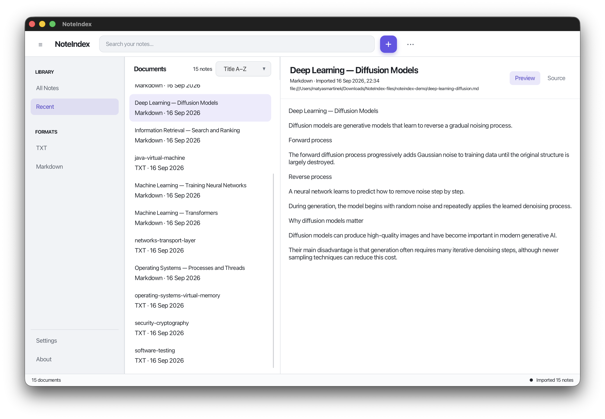
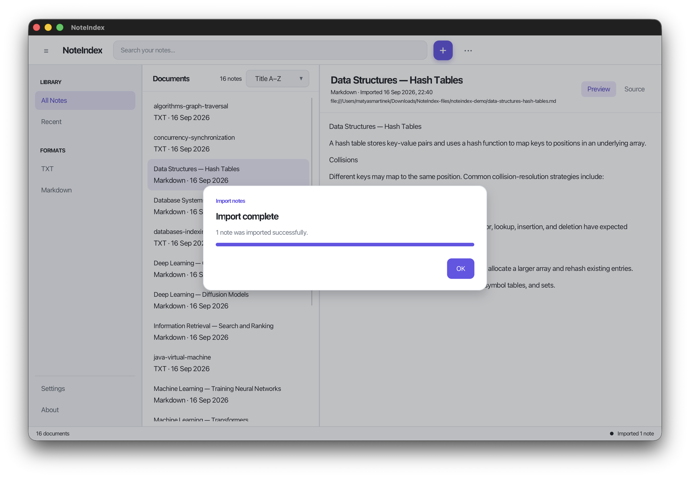
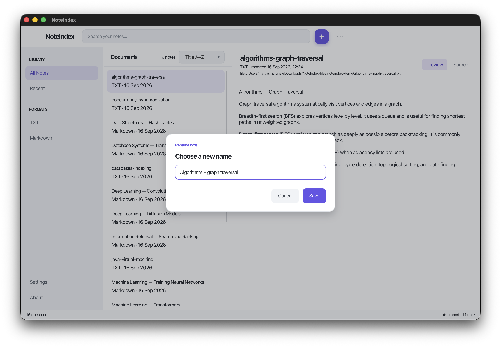
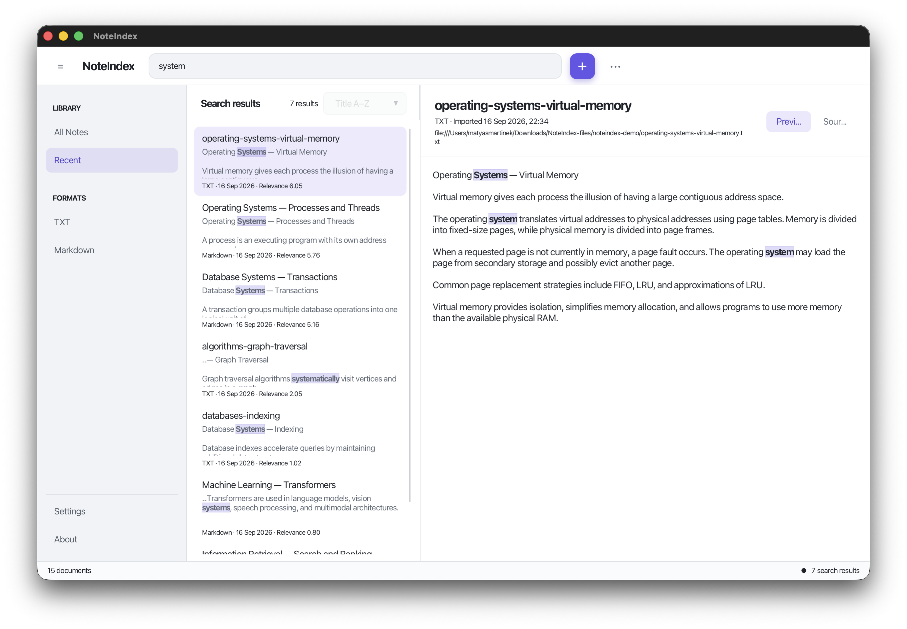
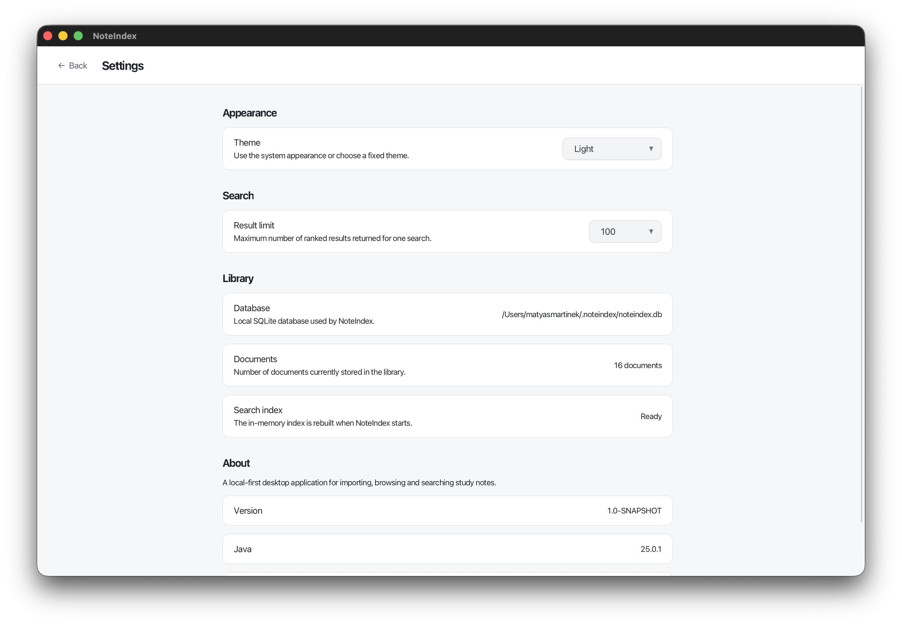
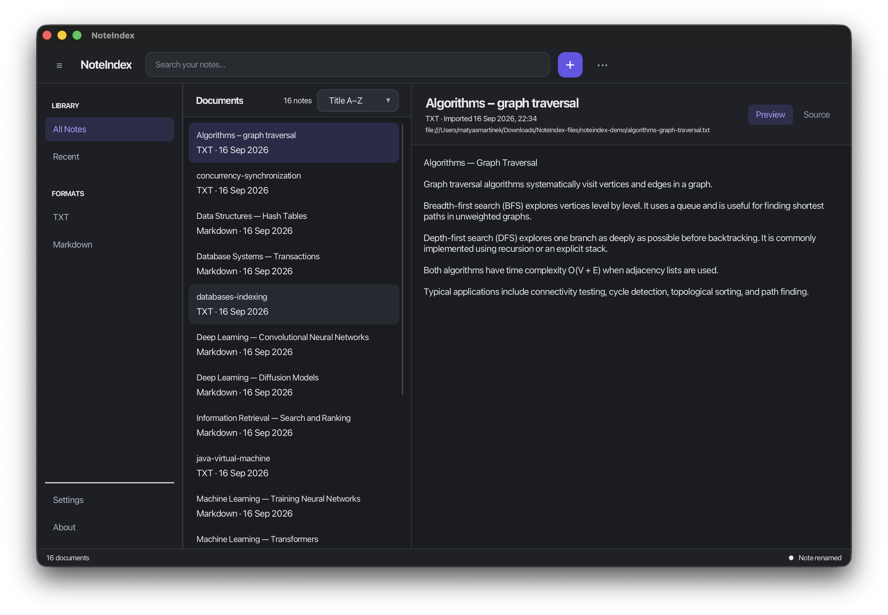

# NoteIndex

## Project Overview

NoteIndex is a modular Java application for collecting and searching study notes. It provides a single local library for plain-text and Markdown files, allowing users to browse imported material and find relevant content without uploading notes to an external service. After Maven has obtained the dependencies, normal application use is local and does not require a cloud service.

The project provides two user interfaces:

- a JavaFX desktop application for importing, browsing, viewing, and searching notes;
- a command-line interface (CLI) for scripting and terminal-based use.

Imported content is stored in a local SQLite database. A full-text search index is rebuilt in memory when NoteIndex starts.

## Main Design Decisions

### Search

NoteIndex uses an inverted in-memory search index built from stored documents.
Queries are analyzed and matched against indexed document terms.

Search results are ranked using a relevance scoring strategy where title
matches have higher importance than body matches.

### Persistence

SQLite is used as the authoritative storage layer. The search index is
considered derived data and is rebuilt from stored documents when required.

## Requirements

- **JDK 25**. The Maven build is configured with `maven.compiler.release=25`; a JRE alone is not sufficient.
- **Apache Maven** capable of running with JDK 25.
- Internet access during the first build so Maven can download JavaFX, SQLite JDBC, JUnit, and build plugins.
- A graphical desktop environment when running the JavaFX interface.
- Write access to the user home directory for the default database and GUI preferences.

JavaFX and SQLite do not need to be installed separately; Maven resolves the required dependencies.

Confirm the active tools before building:

```bash
java -version
mvn -version
```

Both commands should report that Maven is using Java 25.

## Project Structure

The root Maven project contains seven modules:

- **`noteindex-core`** - Shared immutable domain models and common exceptions used by the other modules.
- **`noteindex-importer`** - Importer plugin API, plugin discovery, and built-in importers for plain-text and Markdown documents.
- **`noteindex-persistence`** - Repository API and SQLite/JDBC implementation, including database initialization and schema migration.
- **`noteindex-search`** - Text analysis, query parsing, in-memory indexing, candidate retrieval, relevance ranking, phrase matching, and snippet extraction.
- **`noteindex-application`** - Application-level workflows that coordinate importing, persistence, document management, and searching.
- **`noteindex-gui`** - JavaFX desktop interface, including library browsing, imports, search results, document viewing, and settings.
- **`noteindex-cli`** - Command-line parser, commands, output formatting, and executable CLI entry point.

Additional evaluation resources are included outside the Maven modules:

- **`examples/demo-notes/`** - A small demonstration library containing 8 plain-text and 8 Markdown study notes.
- **`scripts/setup-demo.sh`** - Creates a fresh demonstration SQLite database and imports all example documents through the CLI.
- **`scripts/run-demo-gui.sh`** - Opens the JavaFX interface using the demonstration database, creating it first when necessary.
- 
## Building the Project

Run Maven commands from the repository root.

Build the project and execute the complete test suite:

```bash
mvn clean verify
```

This command:
- compiles all modules,
- runs automated tests,
- verifies that all modules build successfully.

Run the tests without cleaning or performing the remaining verification phases:

```bash
mvn test
```

Before launching an individual child module in a separate Maven invocation, install all reactor artifacts into the local Maven repository:

```bash
mvn install
```

The `install` command also compiles the project and runs its tests unless tests are explicitly skipped.

## Running the Application

### Desktop GUI

First run `mvn install` from the repository root. Then launch the configured JavaFX entry point:

```bash
mvn -f noteindex-gui/pom.xml javafx:run
```

The application opens a startup view while it initializes the local SQLite database and rebuilds the search index. When initialization finishes, the main library window becomes available.

For a ready-to-use evaluation library, use the [Quick Demo](#quick-demo) instead:

```bash
./scripts/run-demo-gui.sh
```

That launcher selects the generated target/demo/noteindex.db database for the GUI without modifying the normal database under ~/.noteindex/.



### Command-Line Interface

First run `mvn install` from the repository root. The CLI module does not define a packaged shell command, so it can be launched through Maven's Exec Plugin:

```bash
mvn -f noteindex-cli/pom.xml exec:java \
  -Dexec.mainClass=cz.martim12.noteindex.cli.NoteIndexCli \
  -Dexec.args="help"
```

Replace `help` in `-Dexec.args` with the desired CLI arguments. For example, use `-Dexec.args="list"` to list imported documents. The available commands are documented in the [CLI Reference](#cli-reference).

## Quick Demo

The repository includes a demonstration library containing **16 study notes**:

- 8 plain-text (`.txt`) documents;
- 8 Markdown (`.md`) documents.

The files are stored under:

```text
examples/demo-notes/
```

The quickest way to evaluate NoteIndex is:

```bash
./scripts/run-demo-gui.sh
```

On the first run, the script automatically:

1. installs the Maven modules required for individual module execution;
2. creates a fresh SQLite database at `target/demo/noteindex.db`;
3. imports all 16 example documents using the NoteIndex CLI;
4. lists the imported documents;
5. performs an example search for `virtual`;
6. starts the JavaFX application using the generated demo database.

The demo setup is isolated from the normal user library. It does **not** modify the default database at `~/.noteindex/noteindex.db`.

To create or reset the demo database without starting the GUI, run:

```bash
./scripts/setup-demo.sh
```

Running the setup script again deletes only the generated `target/demo/` directory and recreates the demonstration database from the example source files.

The generated database is a local demo/build artifact and is intentionally not included in the repository or submission archive.

### Suggested Demo Searches

After the application opens, useful searches include:

| Query | Demonstrates |
|---|---|
| `virtual` | Normal ranked full-text search |
| `neur` | Prefix matching, for example `neural` |
| `"virtual machine"` | Exact quoted-phrase matching |
| `index` | Results across database and information-retrieval notes |
| `concurr` | Prefix matching across concurrency-related notes |

The demo library can also be used to verify the **All Notes**, **Recent**, **TXT**, and **Markdown** filters, document preview/source switching, renaming, deletion, and theme settings.

> The helper scripts use Bash and are intended for macOS/Linux or another Bash-compatible environment. The regular Maven commands documented below remain available independently of these scripts.


## GUI Usage Guide

### Starting the Application

At startup, NoteIndex opens the local database and rebuilds its in-memory search index from stored documents. The status area changes to **Library ready** when the application can be used. A startup dialog displays the database path and error details if initialization fails.

### Importing Documents

Use the **+** button in the toolbar or the import action in the empty-library view to open the native multi-file chooser. Supported files can also be dragged and dropped anywhere in the main window. Imports run in the background, and a progress view reports successful and failed files.



### Browsing and Selecting Documents

The sidebar provides views for all notes, recent notes, plain-text notes, and Markdown notes. The document list can be sorted by newest, oldest, title ascending, or title descending. Selecting a document loads it into the viewer.

The document actions menu and context menus support renaming a note and removing it from NoteIndex. Renaming changes only the displayed title. Deleting a note removes the stored NoteIndex entry but does not delete the original source file.



### Viewing Content

The document viewer shows the title, format, import time, source URI, and content. Use **Preview** to read the searchable presentation and **Source** to inspect the original imported text. Search matches are highlighted in preview mode.

### Searching

Type in the toolbar search field to switch from the library list to ranked search results. Search runs after a short typing delay. Selecting a result opens the matching document and highlights relevant content.

Press `Ctrl+K` on Windows/Linux or `Command+K` on macOS to focus the search field. Press `Esc` to clear it. If a quoted phrase is unfinished, NoteIndex waits for the closing quotation mark and displays an inline warning instead of running an invalid search.



### Settings and Preferences

Open **Settings** from the sidebar. The settings view allows users to:

- follow the system theme or select a fixed light or dark theme;
- choose a search-result limit of 10, 25, 50, 100, or 200;
- view the current database path, document count, and search-index status;
- view application, Java, and JavaFX version information.

Theme and result-limit preferences are persisted using the Java preferences system.



The fixed dark theme uses the same library and document-viewing workflow:



## Supported Document Formats

NoteIndex includes these importers:

| Format | Extensions | Import behavior |
|---|---|---|
| Plain text | `.txt` | Reads UTF-8 content and uses the file name without its extension as the initial title. |
| Markdown | `.md`, `.markdown` | Stores the original UTF-8 Markdown and derives searchable text from its content. A detected Markdown title is used when available; otherwise the file name is used. |

Importing copies the source content into the SQLite library. NoteIndex does not modify the source file. Each normalized source file URI must be unique; importing the same source again is rejected with a message that it has already been imported.

The GUI can import several files in one operation. Individual failures do not prevent the remaining files in that batch from being attempted.

## Searching

Search covers document titles and searchable document content. Results are ordered by relevance, with title matches weighted more strongly than body matches. Standalone terms support prefix matching, which allows results to appear while a term is still being typed.

Examples:

```text
virtual
"virtual machine"
neur
```

- `virtual` performs a normal ranked search.
- `"virtual machine"` requires those terms next to each other in that exact order.
- `neur` can match a longer standalone term such as `neural` through prefix matching.

Prefix matching applies to standalone terms. Terms inside a quoted phrase are matched exactly rather than expanded by prefix.

Use double quotation marks for a required exact phrase:

```text
"virtual machine"
```

Quoted terms must occur next to each other in the same order. In a mixed query such as `java "virtual machine"`, the quoted phrase is required and the standalone term contributes to ranking.

Search results include a relevant text snippet. Matching ranges are highlighted in both the result presentation and the selected document preview. The search index is held in memory and reconstructed from the SQLite database whenever the application service starts.

## CLI Reference

The CLI accepts this general syntax:

```text
noteindex [--database <file>] <command> [arguments]
```

When using the Maven launch command above, place the portion after `noteindex` inside `-Dexec.args`.

### Global Options

| Option | Description |
|---|---|
| `-d, --database <file>` | Use a specific SQLite database instead of the default database. This option must appear before the command. |
| `-h, --help` | Display general help without opening the application service. |
| `-V, --version` | Display the NoteIndex CLI version. |

### Commands

| Command syntax | Description |
|---|---|
| `import <file>` | Import one supported document file. |
| `search [--limit N] <query>` | Search indexed documents and print ranked results. The default limit is 10; `-n N` is an alias for `--limit N`. |
| `list` | List all imported documents with their IDs, formats, import times, and titles. |
| `show <document-id>` | Display metadata and original content for one document. |
| `delete <document-id>` | Remove one document from NoteIndex. The original source file is not deleted. |
| `formats` | List extensions supported by the discovered importer plugins. |
| `help [command]` | Display general help or help for one command. Every command also accepts `-h` or `--help` as its sole argument. |
| `version` | Display the NoteIndex CLI version. |

Document IDs and search limits must be positive numbers. CLI usage errors are written to standard error and return a usage-error exit code; operation failures return a general failure exit code.

The following examples use the Maven launcher shown above:

```bash
# General help
mvn -f noteindex-cli/pom.xml exec:java \
  -Dexec.mainClass=cz.martim12.noteindex.cli.NoteIndexCli \
  -Dexec.args="help"

# Import one file
mvn -f noteindex-cli/pom.xml exec:java \
  -Dexec.mainClass=cz.martim12.noteindex.cli.NoteIndexCli \
  -Dexec.args="import /path/to/note.md"

# List documents
mvn -f noteindex-cli/pom.xml exec:java \
  -Dexec.mainClass=cz.martim12.noteindex.cli.NoteIndexCli \
  -Dexec.args="list"

# Search, limiting output to 25 results
mvn -f noteindex-cli/pom.xml exec:java \
  -Dexec.mainClass=cz.martim12.noteindex.cli.NoteIndexCli \
  -Dexec.args="search --limit 25 virtual"

# Show document 1
mvn -f noteindex-cli/pom.xml exec:java \
  -Dexec.mainClass=cz.martim12.noteindex.cli.NoteIndexCli \
  -Dexec.args="show 1"

# Delete document 1
mvn -f noteindex-cli/pom.xml exec:java \
  -Dexec.mainClass=cz.martim12.noteindex.cli.NoteIndexCli \
  -Dexec.args="delete 1"
```

The current CLI has no rename command; renaming is available in the GUI.

## Data Storage

NoteIndex stores imported documents locally in SQLite. Both the GUI and CLI use this default path:

```text
~/.noteindex/noteindex.db
```

The `~` represents the current user's home directory. NoteIndex creates the parent directory and initializes or migrates the database schema automatically, so no database server or manual schema setup is required.

The CLI can use another database with `--database <file>`. The GUI settings page displays the exact database currently in use. The full-text index is not stored as a separate permanent file; it is rebuilt in memory from SQLite at startup.

The optional demo scripts use a separate database at `target/demo/noteindex.db`. This database is generated from the files in `examples/demo-notes/` and is never used unless the demo setup or demo GUI launcher is explicitly run. It does not replace or modify the normal database under `~/.noteindex/`.


## Testing

Run the complete test suite from the repository root:

```bash
mvn clean verify
```

The current verified result is **248 tests, 0 failures, 0 errors, 0 skipped**. This is a statement of the current test run, not a claim that every possible behavior is covered.

## Programmer Documentation

Generate aggregate Javadoc for all modules from the repository root:

```bash
mvn javadoc:aggregate
```

Maven writes the generated documentation to `target/reports/apidocs/`; open `target/reports/apidocs/index.html` in a browser. Generated Javadoc HTML is a build artifact and is intentionally not included in the submission archive. The submitted source contains the Javadoc comments, package documentation, module documentation, and overview source used to generate it.

## Known Limitations

- Import is limited to UTF-8 plain-text and Markdown files; PDF, image, and OCR import are not supported.
- Storage is a local SQLite database. NoteIndex has no cloud synchronization, shared-library service, or remote database mode.
- One running NoteIndex process per database file is the intended usage. Separate processes maintain separate in-memory indexes and should not concurrently modify the same database.
- The project provides Maven development launch commands, not packaged `.app`, `.dmg`, or other native installers.

## Troubleshooting

### Maven Reports an Unsupported Java Release

Check `java -version` and `mvn -version`. Both must use JDK 25. If Maven reports another Java installation, update `JAVA_HOME` and restart the terminal.

### Maven Cannot Resolve Dependencies

The first build requires access to Maven Central. Check the network connection, proxy configuration, and local Maven settings, then run the build again. If an individual GUI or CLI launch reports missing NoteIndex artifacts, run `mvn install` from the repository root first.

### The GUI Does Not Open

The JavaFX interface requires a graphical desktop session. Review the Maven output for JavaFX startup errors and confirm that Maven is using JDK 25.

### Database Initialization Fails

NoteIndex must be able to create and write to `~/.noteindex` and the SQLite database file. Check filesystem permissions and available disk space. Do not delete an existing database without backing it up, because it contains the imported library.

For CLI diagnosis, `--database <file>` can select a writable alternative location.

### A File Cannot Be Imported

Confirm that the file is a readable regular file with a `.txt`, `.md`, or `.markdown` extension and UTF-8 content. Unsupported extensions are rejected. Importing a source path that is already present in the library is also rejected as a duplicate.

### A Phrase Search Is Not Executed

Every opening double quotation mark must have a closing quotation mark. The GUI displays an unfinished-phrase warning while typing; the CLI reports invalid query syntax.
